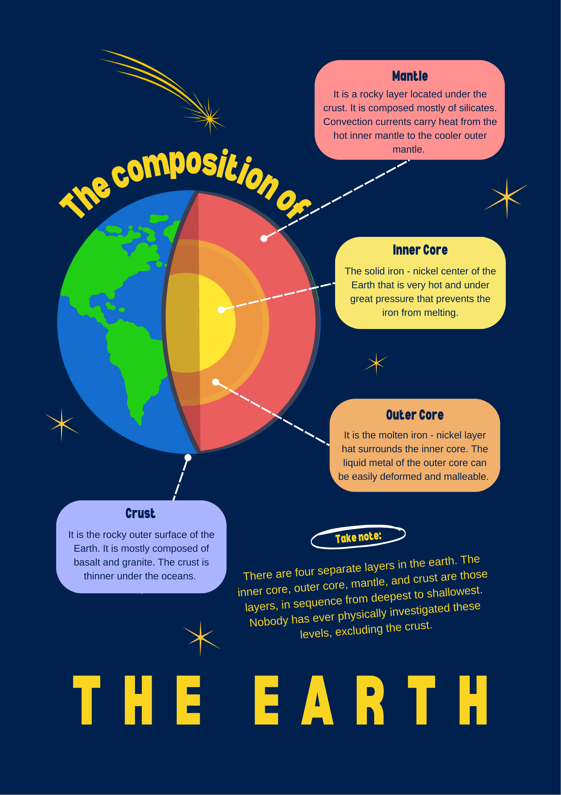

---

title: "Layers of the Earth"
description: "Discover the fascinating structure of Earth's interior."
publishDate: "29 Apr 2025"
topic: "Geology / Earth Science"
tags: ["Earth", "Geology","Education"]

---

## What Are the Layers of the Earth?
**The Earth is not a single solid ball — it is made up of multiple layers**, each with different materials, properties, and states of matter. These layers explain many natural phenomena, including volcanoes, earthquakes, and the magnetic field.

<iframe 
    src="https://my.spline.design/cieloglayersoftheearthnoninteractivecopycopy-TZS1qrzJecqRAK9lMkqeSXPg/" 
    width="100%" 
    height="500" 
    frameborder="0">
</iframe>

---

| Layer         | Composition                        | State        | Thickness            |
| ------------- | ---------------------------------- | ------------ | -------------------- |
| **Crust**     | Rocks (granite, basalt)             | Solid        | 5–70 km              |
| **Mantle**    | Silicate minerals (iron, magnesium) | Semi-solid   | 2,900 km             |
| **Outer Core**| Iron and nickel                    | Liquid       | 2,200 km             |
| **Inner Core**| Iron and nickel                    | Solid        | 1,250 km (radius)    |

---

:::important[Did you know?]
* The crust, where we live, is thinner than the skin of an apple compared to the rest of the Earth!
* The inner core is hotter than the surface of the Sun, reaching temperatures over 5,000°C.
* Earth's magnetic field is generated by the motion of the liquid outer core.
:::

## **1. Crust**
The outermost and thinnest layer of the Earth.

- Made mostly of rocks like granite and basalt.
- Divided into **continental crust** and **oceanic crust**.
- Tectonic plates "float" on the mantle below.

---

## **2. Mantle**
The layer beneath the crust that behaves like a very slow-moving solid.

- Extends to a depth of **~2,900 kilometers**.
- Heat-driven convection currents here cause tectonic plate movement.
- Despite being mostly solid, it can flow over long periods.

---

## **3. Outer Core**
A liquid layer that surrounds the inner core.

- Composed mainly of molten iron and nickel.
- Movement within the outer core generates Earth's magnetic field.

---

## **4. Inner Core**
The Earth's deepest, hottest layer.

- Solid sphere made of iron and nickel.
- Despite the extreme heat (over **5,000°C**), it remains solid due to immense pressure.
- Plays a critical role in Earth's internal energy and magnetism.

---

## Three minutes to the centre of the Earth - BBC

<iframe 
    src="https://www.youtube.com/embed/SeFT0ewzM6g" 
    title="Three minutes to the centre of the Earth - BBC" 
    frameborder="0" 
    allow="accelerometer; autoplay; clipboard-write; encrypted-media; gyroscope; picture-in-picture" 
    allowfullscreen 
    width="100%" 
    height="500">
</iframe>

---

## **Common Misconceptions**
:::caution
The mantle is not completely molten! It is mostly solid rock that flows very slowly under intense heat and pressure.
:::

---

## Key Takeaways:

- **The crust** is where we live, made up of solid rocks.
- **The mantle** is a hot, flowing layer driving plate tectonics.
- **The outer core** is liquid metal, generating the magnetic field.
- **The inner core** is a solid metal ball hotter than the Sun’s surface.

---

## Recap Interactive

Test your knowledge with this quiz!

<iframe 
    src="https://quizlayersoftheearth-main-zmp6g6hsrmgn9yd7758tbh.streamlit.app?embed=true" 
    width="100%" 
    height="750" 
    style="border: none; margin-top: 20px;"
    loading="lazy"
    allowfullscreen
></iframe>

---

## Footnotes

References:
https://education.nationalgeographic.org/resource/resource-library-earth-structure/ ↩   
Animation from Spline community assets ↩  
Video by National Geographic YouTube ↩  

---
